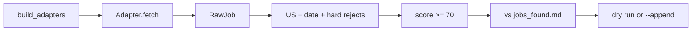

# Auto Search — Project Workflow & Replication Guide

Technical reference for how this repository automates US embedded/systems-software job discovery, what has been built so far, and how to reproduce the same workflow on a new machine or for a new candidate profile.

---

## 1. What this project does

The goal is a **repeatable `/jobsearch` pipeline** that:

1. Fetches jobs from **official employer sources** (company ATS APIs/HTML) and **general job boards** (Indeed, LinkedIn, etc.).
2. Normalizes each posting into a common `RawJob` shape.
3. Applies **hard filters** (US location, freshness, sponsorship, role family, clearance, etc.).
4. **Scores** remaining rows against a candidate profile (threshold **≥ 70**).
5. **Dedupes** against a persistent ledger (`jobs_found.md`).
6. Prints a dry-run report by default; optionally **`--append`** new accepts to the ledger.

The work is split into two layers:

| Layer | Location | Purpose |
|-------|----------|---------|
| **Source discovery / health** | `job_source_endpoint_testing/` | Prove each company or site is reachable; document parsers and HTTP method |
| **Production search scripts** | `job_search_N/` and `job_search_general/` | Full pipeline: fetch → filter → score → dedupe → append |

**Design principle:** never guess an access method in production. Port only methods that passed the endpoint tester.

---

## 2. Repository layout

```text
auto_search/
├── PROJECT_WORKFLOW.md          ← this file
├── jobsearchdocs/               ← shared candidate config + ledger (single source of truth)
│   ├── job_search_profile.json
│   ├── job_search_preferences.json
│   └── jobs_found.md
├── job_source_endpoint_testing/
│   ├── company_targets_ranked.md    ← ranks 1–95
│   ├── part1/ … part10/             ← per-batch company endpoint testers
│   └── general_job_source_testing/  ← 14 job-board site tester
├── job_search_1/ … job_search_10/   ← company-target production scripts
│   ├── jobsearch_partN.py
│   └── jobsearch_partN_architecture.md
└── job_search_general/
    ├── job_search_general.py
    └── job_search_general_architecture.md
```

Each `job_search_N` directory is **self-contained**: one Python file, one architecture doc, no cross-imports between parts. Shared logic is **copied forward** when scaffolding the next part (intentional — each part is independently runnable and reviewable).

---

## 3. Target universe

### 3.1 Ranked companies (95 total)

Canonical list: [`job_source_endpoint_testing/company_targets_ranked.md`](job_source_endpoint_testing/company_targets_ranked.md)

| Part | Ranks | Script | Companies per part |
|------|-------|--------|-------------------|
| 1 | 1–10 | `job_search_1/jobsearch_part1.py` | 10 |
| 2 | 11–20 | `job_search_2/jobsearch_part2.py` | 10 |
| 3 | 21–30 | `job_search_3/jobsearch_part3.py` | 10 |
| 4 | 31–40 | `job_search_4/jobsearch_part4.py` | 10 |
| 5 | 41–50 | `job_search_5/jobsearch_part5.py` | 10 |
| 6 | 51–60 | `job_search_6/jobsearch_part6.py` | 10 |
| 7 | 61–70 | `job_search_7/jobsearch_part7.py` | 10 |
| 8 | 71–80 | `job_search_8/jobsearch_part8.py` | 10 |
| 9 | 81–90 | `job_search_9/jobsearch_part9.py` | 10 |
| 10 | 91–95 | `job_search_10/jobsearch_part10.py` | 5 |

### 3.2 General job boards (14 sites)

Production script: [`job_search_general/job_search_general.py`](job_search_general/job_search_general.py)

Discovery tester: [`job_source_endpoint_testing/general_job_source_testing/unified_job_site_tester.py`](job_source_endpoint_testing/general_job_source_testing/unified_job_site_tester.py)

Contract reference: [`job_source_endpoint_testing/general_job_source_testing/site_search_guide.md`](job_source_endpoint_testing/general_job_source_testing/site_search_guide.md)

---

## 4. Shared configuration

All production scripts read from `jobsearchdocs/` (relative path `../jobsearchdocs` from each `job_search_N/` folder).

### 4.1 `job_search_profile.json`

Defines target **job titles**, **skills**, and `keywords_include` used for scoring. Edit this file to match your background.

### 4.2 `job_search_preferences.json`

Defines operational constraints:

```json
{
  "candidate_context": {
    "work_authorization": { "requires_sponsorship": true }
  },
  "job_search_preferences": {
    "target_country": "United States",
    "job_posting_age_days": 4
  }
}
```

- `job_posting_age_days` is the default freshness window when `--days` is omitted.
- Sponsorship requirement drives `no_sponsorship` hard-reject patterns in the pipeline.

### 4.3 `jobs_found.md`

Append-only **ledger** of previously accepted jobs. Every part and `job_search_general` dedupe against URL, job ID, and normalized `company + title + location` keys before accepting new rows.

**Replication step:** copy or reset this file for a new candidate; never share a ledger across unrelated searches without review.

---

## 5. Pipeline contract (company parts)

Every `jobsearch_partN.py` implements the same flow:



### 5.1 Core data types

| Type | Role |
|------|------|
| `RawJob` | One fetched posting before scoring |
| `Job` | Accepted, scored row ready for ledger |
| `Health` | Per-company/source status: `ok`, `blocked`, `http_429`, etc. |
| `AdapterResult` | `(Health, List[RawJob])` from each adapter |
| `RunContext` | `limit`, `days`, `cutoff` date, HTTP caches |

### 5.2 Hard reject reasons (examples)

Applied before scoring:

- `non_official_source` — URL host not in `OFFICIAL_DOMAINS` for that company
- `location_mismatch` — not US / remote-US per `location_ok()`
- `old_posting` — posted date older than `--days` cutoff
- `no_sponsorship`, `citizenship_required`, `clearance_required`
- `internship`, `part_time`, `non_target_role_family`
- `weak_role_match` — no profile keyword overlap in title/description

### 5.3 Scoring

- Base score ~55; bonuses for keyword hits, title terms (firmware, kernel, embedded, etc.), recent dates.
- **Accept threshold: score ≥ 70**
- Below 70 → `low_score` rejection

### 5.4 Date handling

| Status | Meaning |
|--------|---------|
| `confirmed_recent` | Parsed posted date within window |
| `posted_hidden_top_results` | No date on listing but kept as top-of-board result |
| `old` | Outside `--days` window → hard reject |

### 5.5 CLI (all company parts)

```bash
cd job_search_N
python3 jobsearch_partN.py                    # dry run
python3 jobsearch_partN.py --days 15          # wider freshness window
python3 jobsearch_partN.py --limit 50         # max raw rows per company
python3 jobsearch_partN.py --company "Nuro"   # single company (repeatable)
python3 jobsearch_partN.py --append           # append accepts to ledger
python3 jobsearch_partN.py --self-test        # offline unit checks
python3 jobsearch_partN.py --verbose          # per-adapter progress
```

**Default:** dry run only. Never use `--append` until you have reviewed the printed accepts.

---

## 6. Pipeline contract (general job search)

[`job_search_general/job_search_general.py`](job_search_general/job_search_general.py) uses **site adapters** instead of company adapters:

| Concern | Company parts | General |
|---------|---------------|---------|
| Target | 10 employers | 14 platforms |
| Fetch | Full company job list | Keyword search + pagination |
| URL trust | `is_official_url(company, url)` | `is_platform_url(url, site)` |
| Query | Implicit (all company jobs) | Rotating profile queries or `--query` |
| HTTP | Mostly stdlib `urllib` | `curl_cffi` for most HTML sites |

### 6.1 Query rotation

When `--query` is omitted, one of these is chosen per calendar day:

```text
embedded software engineer
firmware engineer
systems software engineer
linux kernel engineer
```

### 6.2 CLI

```bash
cd job_search_general
python3 job_search_general.py --self-test
python3 job_search_general.py --sites indeed,remoteok --days 7
python3 job_search_general.py --sites all --limit 30
python3 job_search_general.py --query "firmware engineer" --append
```

Site slugs: `linkedin`, `indeed`, `dice`, `builtin`, `simplyhired`, `remoteok`, `wwr`, `remotive`, `hn`, `glassdoor`, `ziprecruiter`, `wellfound`, `monster`, `otta`.

### 6.3 Dependencies

```bash
# Minimum (stdlib-only sites: RemoteOK, WWR, Remotive, HN)
python3 job_search_general.py --sites remoteok,hn

# Phase A/B (most HTML sites)
pip install curl_cffi

# Phase C (Wellfound, Monster, Otta fallbacks)
pip install playwright
playwright install chromium

# Optional: headed browser when headless is blocked
export JOB_SITE_HEADED=1
```

Phase C adapters **degrade gracefully**: if Playwright is missing, they log `skipped`/`blocked` and return empty results without crashing the run.

---

## 7. Two-phase delivery workflow (how to build a new part)

This is the process used for Parts 1–10 and general. Replicate it for Part 11+ or new sites.

### Phase A — Endpoint tester (source discovery)

**Location:** `job_source_endpoint_testing/partN/unified_job_source_tester.py`

**Goal:** For each company in the batch, prove:

- HTTP method works (`requests`, `curl_cffi`, or `playwright`)
- Parser returns title + URL (+ location when available)
- US filter can be applied at source when supported

**Run:**

```bash
python3 job_source_endpoint_testing/partN/unified_job_source_tester.py
```

**Exit code 0** when all companies return `status=ok`. Document any `blocked` sources in the part README.

**Pattern doc:** [`job_source_endpoint_testing/part1/ARCHITECTURE_source_discovery_tester_pattern.md`](job_source_endpoint_testing/part1/ARCHITECTURE_source_discovery_tester_pattern.md)

Discovery order per company:

```text
1. Official ATS/API from company guide
2. Official HTML careers page
3. curl_cffi if stdlib blocked
4. Playwright if JS-rendered
5. Detail-page fallback if search page blocked
```

### Phase B — Production script

**Scaffold:**

```bash
cp -r job_search_{N-1} job_search_N
mv job_search_N/jobsearch_part{N-1}.py job_search_N/jobsearch_partN.py
# Edit: branding, COMPANY_TERMS, OFFICIAL_DOMAINS, adapters, build_adapters(), self-tests
```

**Port adapters** from the endpoint tester into `BaseAdapter` subclasses inside `jobsearch_partN.py`. Each adapter implements:

```python
def fetch(self, ctx: RunContext) -> AdapterResult:
    # HTTP fetch → parse → US filter → RawJob list → Health
```

**Update:**

- `COMPANY_TERMS` — domain keywords for scoring bonuses
- `OFFICIAL_DOMAINS` — hosts allowed for `is_official_url()`
- `build_adapters()` — one adapter instance per company
- `run_self_tests()` — offline parser/URL/dedupe checks
- `jobsearch_partN_architecture.md` — command interface + company table

**Do not** change shared `jobsearchdocs/` schema without updating all parts.

### Phase C — Verification

Run all three before merging:

```bash
# 1. Endpoint health
python3 job_source_endpoint_testing/partN/unified_job_source_tester.py

# 2. Offline checks
python3 job_search_N/jobsearch_partN.py --self-test

# 3. Live dry run (no --append)
python3 job_search_N/jobsearch_partN.py --days 15
```

**Success criteria:**

- Self-test passes
- Source health table shows `ok` for all companies (or documented `blocked` with graceful empty result)
- Dry run completes without traceback
- `Raw jobs` > 0 for most parts; `Accepted` may be 0 if filters are strict — that is normal

---

## 8. Adapter catalog (by ATS / method)

Reuse these patterns when scaffolding new parts. Implementations live inside the part scripts (copy from the earliest part that introduced the adapter).

| Adapter family | Introduced in | Used in (examples) |
|----------------|---------------|-------------------|
| `GreenhouseAdapter` | Part 1 | Ubiquiti, Nuro, GoPro, Alarm.com |
| `AshbyAdapter` | Part 1 | Applied Intuition, Netgear, Serve Robotics |
| `LeverAdapter` | Part 5 | Waabi |
| `WorkdayCXSAdapter` | Part 2 | Boston Dynamics, Cognex, iRobot |
| `OracleCEAdapter` | Part 2/3 | ON Semi, Resideo |
| `SmartRecruitersAdapter` | Part 3/8 | Microchip, Renesas, Wabtec |
| `EightfoldPCSAdapter` | Part 4 | Infineon (paginated) |
| `JibeAdapter` | Part 2/4/5 | Industrial/medical employers |
| `WorkableAdapter` | Part 8 | TP-Link (`jobs.md`) |
| `MediaTekCrawlAdapter` | Part 8 | MediaTek Next.js BFS crawl |
| `STMicroEightfoldAdapter` | Part 9 | PCS API + HTML embed fallback |
| `ICIMSAdapter` | Part 9 | Lattice Semiconductor |
| `SynapticsHTMLAdapter` | Part 9 | HTML link scrape (may be `blocked`) |
| `ADPWorkforceAdapter` | Part 9 | Hanwha Vision |
| `PinpointAdapter` | Part 10 | Brivo JSON |
| `GemGraphQLAdapter` | Part 10 | Wyze |
| `MayMobilityGreenhouseAdapter` | Part 7 | Dual Greenhouse board fallback |

---

## 9. What was built (current status)

As of the Parts 6–10 + general delivery on `main`:

| Deliverable | Status | Notes |
|-------------|--------|-------|
| Parts 1–5 | Complete | Ranks 1–50 |
| Part 6 | Complete | Ranks 51–60; Greenhouse, Ashby, Workday, Lever |
| Part 7 | Complete | Ranks 61–70; May Mobility dual-board |
| Part 8 | Complete | Ranks 71–80; Workable, MediaTek, Oracle, SmartRecruiters |
| Part 9 | Complete | Ranks 81–90; Eightfold, ICIMS, ADP, Synaptics |
| Part 10 | Complete | Ranks 91–95; Pinpoint, Gem |
| `job_search_general` | Complete | 14 sites; Phases A/B/C |

### 9.1 Known degraded sources (expected)

| Source | Symptom | Mitigation |
|--------|---------|------------|
| Synaptics (Part 9) | `blocked` / Cloudflare | Adapter returns empty list; run continues |
| Motorola Workday (Part 7) | Occasional `http_429` | Retry later; rate limiting |
| Glassdoor (general) | `parser_failed` | HTML layout changes; update parser |
| Wellfound (general) | `blocked` without Playwright | Install Playwright + `JOB_SITE_HEADED=1` |
| Monster (general) | `samsearch_blocked` | Playwright + samsearch route |
| Otta (general) | Auth / WTTJ redirect | Playwright tier or skip |

---

## 10. Git workflow

Branch naming: **`cursor/<short-description>`**

Typical flow per deliverable:

```bash
git checkout main
git pull origin main
git checkout -b cursor/job-search-part-N

# implement + verify
git add job_search_N/   # only relevant paths
git commit -m "Add job search Part N for ranks X–Y with … adapters."
git push -u origin HEAD

# merge to main (PR or fast-forward)
git checkout main
git merge cursor/job-search-part-N
git push origin main
```

Commit message style: one sentence focused on **why** (rank range + adapter families), not a file list.

---

## 11. Replication checklist (new machine)

```bash
# 1. Clone
git clone git@github.com:DivyeshSankhla/auto_search.git
cd auto_search

# 2. Python
python3 --version   # 3.10+ recommended

# 3. Optional deps for general search
pip install curl_cffi
pip install playwright && playwright install chromium

# 4. Customize candidate files
vim jobsearchdocs/job_search_profile.json
vim jobsearchdocs/job_search_preferences.json
# Optional: truncate or replace jobsearchdocs/jobs_found.md

# 5. Smoke test
python3 job_search_7/jobsearch_part7.py --self-test
python3 job_search_general/job_search_general.py --self-test

# 6. Live dry run (one company part + one general site)
python3 job_search_7/jobsearch_part7.py --company "Nuro" --days 15
python3 job_search_general/job_search_general.py --sites remoteok --days 7

# 7. Full batch (time-consuming; run overnight if needed)
for n in 1 2 3 4 5 6 7 8 9 10; do
  python3 job_search_${n}/jobsearch_part${n}.py --days 15
done
python3 job_search_general/job_search_general.py --sites all --days 7
```

---

## 12. Adding Part 11 or new companies

1. Add ranks to `company_targets_ranked.md`.
2. Create `job_source_endpoint_testing/part11/` with `unified_job_source_tester.py`, README, architecture doc.
3. Prove all sources `ok` (or document `blocked`).
4. Scaffold `job_search_11/` from `job_search_10/`.
5. Port only the adapters needed; drop unused adapters from the copied file to limit size.
6. Run verification trio (§7 Phase C).
7. Branch, commit, push, merge.

For **one-off company additions** to an existing part: add adapter + `COMPANY_TERMS` + `OFFICIAL_DOMAINS` + self-test case + architecture table row; re-run that part's endpoint tester entry.

---

## 13. Adding a new job board (general)

1. Document search URL, pagination, and JD fetch in `site_search_guide.md`.
2. Add `test_<site>()` to `unified_job_site_tester.py`; confirm `ok` in live table.
3. Add `SiteAdapter` subclass to `job_search_general.py`.
4. Register in `build_site_adapters()` and `SITE_SLUGS`.
5. Add `PLATFORM_DOMAINS` entry for `is_platform_url()`.
6. Extend `--self-test` with parser fixtures.
7. Update `job_search_general_architecture.md`.

---

## 14. Operational tips

- **Dry run first.** Review accepts and rejection histogram before `--append`.
- **Rate limits.** Workday and some APIs return `http_429`; increase `REQUEST_DELAY_SECONDS` or reduce `--limit`.
- **Zero accepts is not always failure.** Strict filters (sponsorship, role family, score ≥ 70) often yield `Accepted: 0` while fetch health is `ok`.
- **Ledger growth.** `jobs_found.md` grows with each `--append`; dedupe prevents re-adding the same URL/ID.
- **Single-file scripts.** Each part is ~1.5k–2k lines by design; split only if maintenance cost exceeds ~2500 lines.

---

## 15. Reference documents

| Document | Purpose |
|----------|---------|
| [`job_source_endpoint_testing/company_targets_ranked.md`](job_source_endpoint_testing/company_targets_ranked.md) | Master company list |
| [`job_source_endpoint_testing/partN/README.md`](job_source_endpoint_testing/part1/README.md) | Per-batch tester notes |
| [`job_source_endpoint_testing/general_job_source_testing/site_search_guide.md`](job_source_endpoint_testing/general_job_source_testing/site_search_guide.md) | Per-site search contract |
| [`job_search_N/jobsearch_partN_architecture.md`](job_search_7/jobsearch_part7_architecture.md) | Per-part command + adapter table |
| [`job_search_general/job_search_general_architecture.md`](job_search_general/job_search_general_architecture.md) | General sites + phases |

---

## 16. Summary

This repository implements a **test-first, adapter-based job search factory**:

1. **Discover** official access paths with endpoint testers.
2. **Port** proven parsers into standalone per-batch scripts.
3. **Filter and score** uniformly against shared profile/preferences.
4. **Dedupe** via a shared markdown ledger.
5. **Extend** to job boards via `job_search_general` with the same pipeline but site-level adapters.

Give this file plus customized `jobsearchdocs/` to a new operator and they can run, verify, and extend the same workflow without re-deriving the architecture.
